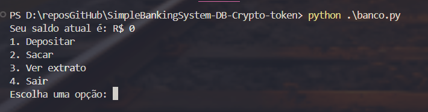

# Sistema Bancário Simples

## Descrição do Projeto
Este projeto é um sistema bancário simples que permite ao usuário realizar operações básicas como depósitos, saques e visualização de extrato.

## Funcionalidades
1. **Depósito**: O usuário pode depositar qualquer valor positivo na conta. Todos os depósitos são registrados e exibidos no extrato.
2. **Saque**: O usuário pode realizar até 3 saques por dia com um limite máximo de R$ 500,00 por saque. Se o usuário não tiver saldo suficiente, será exibida uma mensagem informando que o saque não é possível. Todos os saques são registrados e exibidos no extrato.
3. **Extrato**: O usuário pode visualizar todas as transações realizadas na conta, incluindo depósitos e saques. O saldo atual da conta também é exibido.
4. **Menu de opções**: o usuário terá um menu com 4 opções:
```
1. Depositar
2. Sacar
3. Ver extrato
4. Sair
```
Acima do menu será exibida a mensagem com o saldo atualizado do usuário. <br>
Caso o usuário digite algo diferente das opções do menu, uma mensagem de alerta para reafzer a operação será exibida.
Será exibido, a partir do primeiro saue, um aviso sobre o número de saques feito pelo usuário.



## Como Usar
Para usar este sistema bancário simples, você precisa seguir estas etapas:
1. Clone o repositório para o seu computador local.
2. Navegue até a pasta do projeto.
3. Execute o arquivo `python .\banco.py`.

## Próximos Passos
Após a implementação inicial do projeto, planejamos adicionar as seguintes melhorias e recursos:

1. **Banco de Dados**: Implementar um banco de dados para armazenar as informações da conta do usuário de forma persistente.
2. **Interface do Usuário**: Desenvolver uma interface gráfica para tornar o sistema mais fácil de usar.
3. **Autenticação e Segurança**: Adicionar autenticação para proteger as informações do usuário e criptografia para garantir a segurança dos dados.
4. **Testes**: Escrever testes unitários para garantir que todas as funcionalidades estejam funcionando corretamente.
